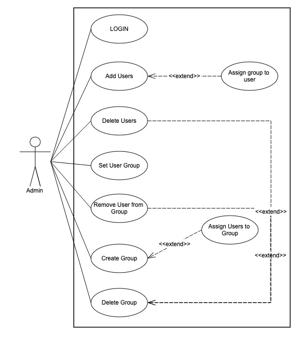
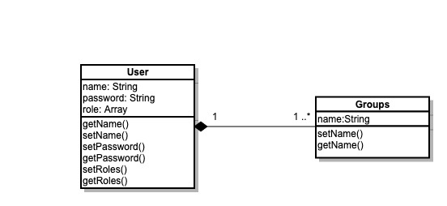
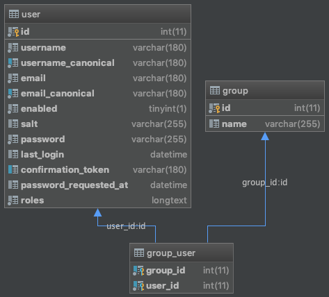

# User Management in Symfony 4
User Management Implementation in Symfony 4

## Stories

• As an admin I can add users — a user has a name.

• As an admin I can delete users.

• As an admin I can assign users to a group they aren’t already part of.

• As an admin I can remove users from a group.

• As an admin I can create groups.

• As an admin I can delete groups when they no longer have members.

## UML - Use case diagram

## UML - Class Diagram

## ERD - Database Schema

Please note that the ERD has been generated from phpStorm after I created the actual database using the Symfony make utility

## Technical overview
Since we are going to work with users and the user will have roles (as represented by the fact that there is an 'admin' user), I figured that instead of re-inventing the wheel, i'll just use the FOS User Bundle.

Then, using the maker bundle, I created the Group table and linked it to the user table in a many to many relationship.

Note: the first time I created those tables, they were named 'user' and 'group'. When writing your own DQL, you can cater for those reserved keywords by using a back-tick (`). However, I had to change the names of those table because some modules do not use back-ticks in their queries.

Now to tackle the different stories, I have 2 ways to do it:
1. Generate the whole admin section using EasyAdmin (takes only 5 minutes to do)
2. Code the whole thing.

Since the EasyAdmin part only takes 5 minutes to do, I did it anyway, just to show how easy it is to create dynamic back-ends.

However, for the purpose of this demo, I am also going to code each of the stories mentioned above.

## Getting the demo to run
1. Copy the .env file and name the new file .env.local
2. Add in proper database connection details inside the .env.local file
3. Run the command `composer install` to install all dependencies
4. Run the command `php bin/console doctrine:database:create` to create the database
5. Run the command `php bin/console doctrine:schema:update --force` to create the schema
6. Create an admin user by following the next steps:
7. Run the command `php bin/console fos:user:create` and follow the instructions to create your first user
8. Run the command `php bin/console fos:user:activate` and give the username to activate the user
9. Run the command `php bin/console fox:user:promote` and give the username and role as ROLE_ADMIN to promote the user to administrator
10. Run the command `php bin/console server:run` to run the built-in web server
11. Connect to the url provided by the command (usually http://127.0.0.1:8000)
 
